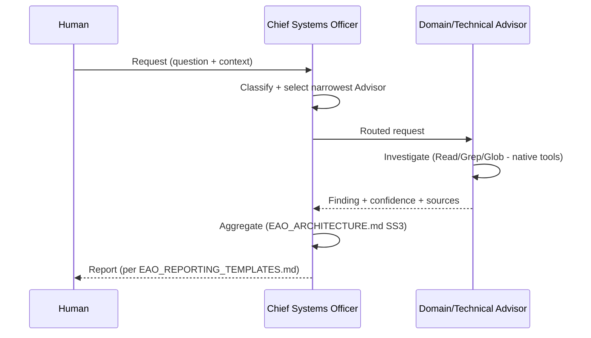
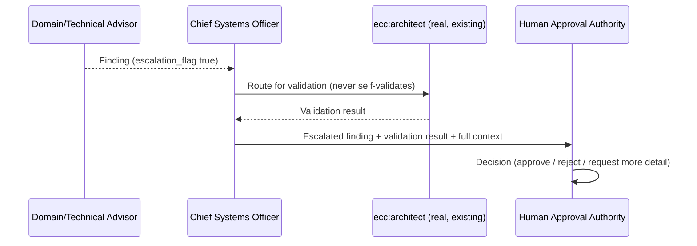

# EAO Communication Protocol (Proposal — Extension)

```
Status: Proposed — pending ADR-024 acceptance. Elaborates EAO_ARCHITECTURE.md SS1; does not modify it.
```

## Purpose

Full detail of agent-to-agent communication, beyond the summary already in `EAO_ARCHITECTURE.md` §1.

## Request Model

A request is: `{ requester, target_role, question, context_refs, priority, timeout }`. `context_refs` cites specific files/commits/prior reports — never an unstated assumption (consistent with the Shared Memory Model's citation requirement).

## Response Model

A response is: `{ responder, finding, confidence_note, sources_cited, escalation_flag (bool) }`. Every response is attributable to exactly one role — no anonymous or blended response at this stage (blending happens only at Aggregation, `EAO_ARCHITECTURE.md` §3).

## Advisory Routing

CSO receives the initial request, classifies it, and routes to the narrowest relevant role(s), per `EAO_ARCHITECTURE.md` §2. Routing is single-hop by default — a Domain Advisor does not re-route to another Domain Advisor without returning to CSO first, preventing untracked routing chains.

## Escalation Routing

Any response with `escalation_flag: true` (Critical severity, LOCKED-file involvement, or a proposed override of an existing reviewer's finding) routes directly to the Human Approval Gate (`EAO_PERMISSION_MODEL.md`), bypassing normal aggregation — it is surfaced immediately, not queued behind lower-priority findings.

## Broadcast Messages

Used only for one purpose: notifying all active roles that the Runtime is entering Shutdown (`EAO_RUNTIME_ARCHITECTURE.md`). No other broadcast type exists — routine findings are always targeted request/response, never broadcast, to keep every finding attributable.

## Priority Handling

Priority follows the same three factors as Task Prioritization (`EAO_ARCHITECTURE.md` §6): blocking status, risk severity, governance sensitivity. A higher-priority request is served before a lower-priority one *only* when both are queued for the same role simultaneously — priority never preempts a request already in progress.

## Timeouts

A request without a response within its stated `timeout` is marked Failed (per `EAO_RUNTIME_ARCHITECTURE.md`'s Failure Handling) and reported as such — never silently dropped, never infinitely retried.

## Error Propagation

An error in one role's response does not halt the Runtime — it is reported as a Failed finding for that specific request, and aggregation proceeds with the remaining, successful findings, clearly marking the gap rather than silently omitting it.

## Human Escalation

The terminal step for any Critical or governance-sensitive finding: it is presented to a named human approver with full context (originating role, request, finding, why it was escalated) — never summarized down to a bare flag without the underlying detail available.

## Sequence Diagram — Normal Advisory Request



## Sequence Diagram — Escalation Path



## Relationship to Existing Documents

Does not modify `EAO_ARCHITECTURE.md`. Elaborates §1 (Communication), §2 (Routing), §3 (Aggregation), §6 (Prioritization), §7 (Escalation) into concrete message shapes and diagrams.

## References

`brain/AI/EAO_ARCHITECTURE.md` §1, §2, §3, §6, §7

## Related Documents

`EAO_RUNTIME_ARCHITECTURE.md` · `EAO_RUNTIME_ROUTING.md` · `EAO_SYSTEM_SEQUENCE.md`
