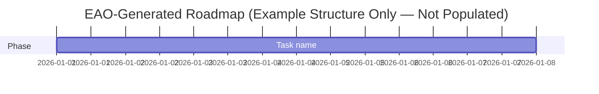

# EAO Reporting Templates (Proposal)

```
Status: Proposed — pending ADR-024 acceptance. Every template below is advisory output only.
```

## Purpose

Defines the fixed structure for each of the 17 required EAO outputs, so aggregation across roles (`EAO_ARCHITECTURE.md` §3) stays consistent regardless of which role or run produced it.

## 1. Repository Status Report
Branch · ahead/behind remote · staged/unstaged/untracked files · last N commits (hash, one-line summary).

## 2. Project Health Report
Narrative summary + the relevant Dashboard metrics (`EAO_DASHBOARD_SPEC.md`) as of this run.

## 3. Architecture Health Report
Per methodology document: LOCKED status, last-modified commit, known open gaps, ADR coverage (yes/no).

## 4. Documentation Health Report
Broken links found · duplicate concepts found · missing cross-references found · glossary sync status.

## 5. Governance Health Report
Policy consistency findings · responsibility-mapping conflicts · human-approval-gate coverage per open proposal.

## 6. Research Gap Report
List of referenced-but-unspecified concepts (the "Evidence Standards Annex" pattern), each with originating document and first-flagged date.

## 7. Risk / Flag Register
Table: **Finding | Severity (Critical/High/Medium/Low) | Location | Originating Role | Recommended Owner | Status.**

## 8. Requirements Backlog
Table: **Requirement | Source (ADR/gap/TODO) | Priority factors (blocking/risk/governance-sensitivity, per `EAO_ARCHITECTURE.md` §6) | Status.**

## 9. Task Breakdown
Per backlog item: ordered concrete steps, each with an owning role or "human-only."

## 10. Dependency Map
Table or Mermaid `graph`: **Document/Task A → depends on → Document/Task B**, plus whether the dependency is satisfied.

## 11. ADR Recommendation List
Decisions found in the repository's history/documents that lack a formal ADR, each with a suggested ADR title and rationale (the exact gap-type this session's own PhD-level audit found for Evidence Model, Basic Validation Framework, DQR, and HQC).

## 12. Roadmap
Phased, ordered list of backlog items — **explicitly marked non-binding until human-approved** (`EAO_PERMISSION_MODEL.md`).

## 13. Mermaid Gantt Chart

Populated only from actual Roadmap items at generation time — never placeholder dates presented as real schedule commitments.

## 14. Critical Path
The single longest unbroken dependency chain in the current Dependency Map, named explicitly.

## 15. Next Action Plan
Exactly one recommended next step, with rationale — never a list of equally-weighted options (that's the Roadmap's job).

## 16. Human Approval Checklist
Per pending proposal: which gates (`EAO_PERMISSION_MODEL.md`) are outstanding, each as a literal ☐ checkbox.

## 17. Specialist Advisor Recommendations
Which Domain/Technical Advisor (or existing real reviewer, e.g. `ecc:architect`) should be invoked next, and why — the CSO's own routing output made explicit and auditable.

## References

`brain/AI/EAO_ARCHITECTURE.md` §2, §3

## Related Documents

`EAO_ARCHITECTURE.md` · `EAO_DASHBOARD_SPEC.md` · `EAO_SKILL_LIBRARY.md`
