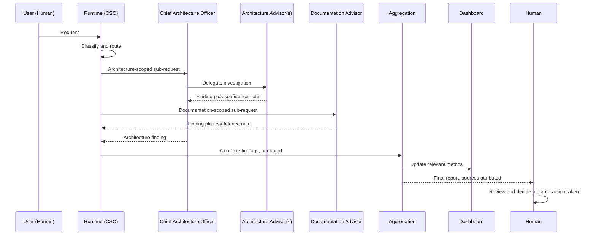
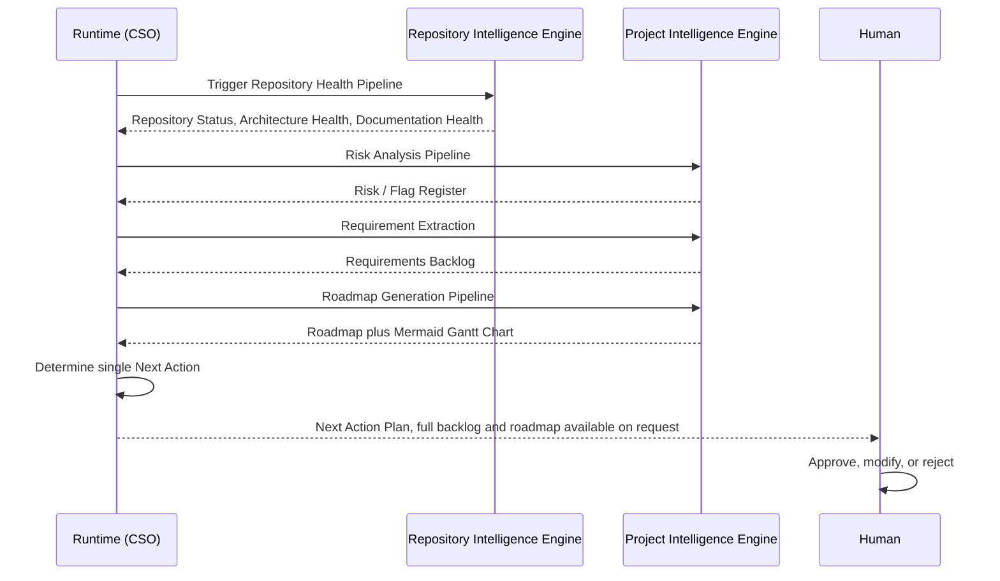

## EAO System Sequence Diagrams (Proposal - Extension)

Status: Proposed - pending ADR-024 acceptance. Diagrams describe intended flow once activated; nothing here has executed.

### Purpose

Full end-to-end sequence diagrams composing roles already defined across the EAO document set - distinct from EAO_COMMUNICATION_PROTOCOL.md's two protocol-level diagrams (single request/response, and escalation), which these build on.

### Sequence 1: Full Advisory Request, Multi-Role

### Sequence 2: Repository Scan to Next Actions

### Notes on Both Sequences

- No step in either diagram commits, merges, or pushes anything - both terminate in a human decision point, consistent with EAO_PERMISSION_MODEL.md.
- Any Critical-severity finding surfacing mid-sequence interrupts the normal flow and routes immediately via the Escalation Path (EAO_COMMUNICATION_PROTOCOL.md), not shown here for clarity but binding in all cases.
- Both sequences are examples of the Execution Pipelines (EAO_EXECUTION_PIPELINES.md) composed together, not new pipelines of their own.

### Relationship to Existing Documents

Composes EAO_COMMUNICATION_PROTOCOL.md's request/response and escalation diagrams, EAO_RUNTIME_ROUTING.md's routing rules, and EAO_EXECUTION_PIPELINES.md's named pipelines into two full system-level views. Introduces no new role, gate, or rule.

### References

brain/AI/EAO_COMMUNICATION_PROTOCOL.md; brain/AI/EAO_RUNTIME_ROUTING.md; brain/AI/EAO_EXECUTION_PIPELINES.md; brain/AI/EAO_PLATFORM_ARCHITECTURE.md

### Related Documents

EAO_PLATFORM_ARCHITECTURE.md, EAO_RUNTIME_ARCHITECTURE.md
