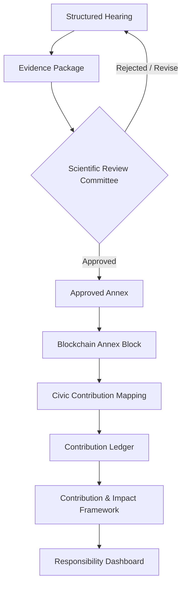

# Annex, Blockchain Verification & Civic Contribution Architecture

**Status:** Foundation Architecture document. Not implementation, not a database schema, not a blockchain platform choice, not smart-contract code. Defines the relationship between existing canonical concepts (Structured Hearings, Responsibility Annexes, the Contribution & Impact Framework) and the new elements introduced by this architecture decision (Scientific Review Committee, Blockchain Annex Block, Civic Contribution, Contribution Ledger).

**Canonical status:** this document is the canonical reference for how a Structured Hearing becomes an approved Annex, how that Annex is integrity-verified, and how it maps to a Civic Contribution. It does not redefine or duplicate `docs/source/methodology/RESPONSIBILITY_ANNEXES.md`, `docs/source/methodology/STRUCTURED_HEARINGS.md`, or `brain/FOUNDATION/02_CONTRIBUTION_IMPACT_FRAMEWORK.md` — those three documents have each been updated with a cross-reference to this one and a small addition reflecting the new lifecycle stage; none of their existing canonical content was rewritten.

---

## 1. Purpose

This document exists to close a gap: prior documents defined Structured Hearings, Responsibility Annexes, and the Contribution & Impact Framework in isolation, but did not specify how an individual hearing's evidence becomes an integrity-verified, tamper-evident record, nor how downstream civic action is required to trace back to that verified record. This architecture makes that chain explicit and closes it against two specific failure modes: (1) a civic contribution being claimed without any verified evidentiary basis, and (2) sensitive testimony being exposed through an integrity mechanism meant only to prove that a record hasn't been altered.

## 2. Full Lifecycle

1. **Structured Hearing** — the facilitated session (`docs/source/methodology/STRUCTURED_HEARINGS.md`), unchanged.
2. **Evidence Package** — the Hearing's documented output, assembled for review (§3).
3. **Scientific Review Committee** — reviews the Evidence Package (§3); approves or returns it for revision. No shortcut exists from Evidence Package directly to Annex.
4. **Approved Annex** — the verified evidence unit (§3), only once approved.
5. **Blockchain Annex Block** — an integrity/timestamp/approval record produced only after approval (§3).
6. **Civic Contribution Mapping** — a downstream civic action, responsibility, or intervention is mapped to one or more Approved Annexes (§3).
7. **Contribution Ledger** — the durable record of mapped Civic Contributions (§3) — not a new storage system, an extension of `AuditLog` exactly as Responsibility Evidence already is.
8. **Contribution & Impact Framework** — consumes the Contribution Ledger (§4).
9. **Responsibility Dashboard** — aggregates Contribution & Impact Framework output for display (§5).

## 3. Definitions

- **Evidence Package** — the structured, documented output of a Structured Hearing: the account itself, any supporting material gathered during the Hearing, and the Facilitator's notes. It is *not yet* an Annex — it has not been reviewed.
- **Scientific Review Committee** — a named body of Experts and Reviewers (drawing on the existing Expert and Reviewer roles defined in `docs/source/foundation/01_HARM_OPERATING_SYSTEM.md` §Roles) responsible specifically for Annex approval. This is a specific, formal review body, distinct from the general single-Reviewer pattern used elsewhere in the Responsibility Evidence Model — Annex approval requires committee-level review because an Approved Annex triggers an irreversible Blockchain Annex Block.
- **Annex (Approved Annex)** — **the verified evidence unit**, not merely a document or PDF attachment. An Annex is the Evidence Package once the Scientific Review Committee has confirmed its evidentiary basis, quality, and consistency with the organization's trauma-informed and ethical standards. Before approval, it is only an Evidence Package; the term "Annex" (unqualified) always means an *approved* Annex in this architecture.
- **Blockchain Annex Block** — **an integrity, timestamp, and approval record — never the storage of raw sensitive testimony.** It contains: a cryptographic hash of the Approved Annex's content, the Scientific Review Committee's approval signature/attestation, and a timestamp. It proves that a specific, identified Annex was approved at a specific time and has not been altered since. It does not contain the testimony, the participant's identity, or any content capable of re-exposing sensitive material. The underlying Annex content remains governed by the organization's existing Data Policy and Ethics Charter, stored exactly as any other verified evidence record — the blockchain layer adds tamper-evidence, not new storage.
- **Civic Contribution** — a downstream civic action, responsibility, or intervention undertaken in response to one or more Approved Annexes. A Civic Contribution is **not a new concept competing with "Contribution"** as already defined in `brain/FOUNDATION/02_CONTRIBUTION_IMPACT_FRAMEWORK.md` §2/§5 — it is that same concept, specifically in the case where the underlying Responsibility Evidence cites at least one Approved Annex. Every Civic Contribution is a Contribution; not every Contribution is necessarily a Civic Contribution (a Contribution may instead cite a witness account, public record, or other Evidence Source per that framework's §7 Verification methods).
- **Contribution Ledger** — **not a new storage system.** It is the aggregate, append-only view over Responsibility Evidence records that are Annex-mapped Civic Contributions, extending `AuditLog` exactly as the Responsibility Evidence Model already extends it (`brain/GOVERNANCE/RESPONSIBILITY_EVIDENCE_MODEL.md` §7). "Ledger" here names the aggregate view, not a distinct database or blockchain.

## 4. Relationship to the Contribution & Impact Framework

The Contribution & Impact Framework (`brain/FOUNDATION/02_CONTRIBUTION_IMPACT_FRAMEWORK.md`) already defines Contribution, Responsibility Evidence, Verification, Trust, and Impact in general terms. This architecture does not redefine any of them — it specifies one particular, more rigorous path through that framework's existing Contribution Lifecycle (§4 of that document): a Civic Contribution's Responsibility Evidence (§6 of that document) must, in this path, cite at least one Approved Annex as its Evidence Source, and that Annex must itself carry a valid Blockchain Annex Block. The framework's Verification (§7), Trust (§8), and Impact (§9) sections apply unchanged — this architecture only adds a stricter evidentiary requirement for the specific case of Annex-derived contributions.

## 5. Relationship to the Responsibility Dashboard and the HARM Innovation Order

`docs/source/foundation/01_HARM_OPERATING_SYSTEM.md` sequences the five Innovations as Responsibility Biography Lab → Responsibility Mapping Lab → Responsibility Dashboard → Responsibility Annexes → Civic Intelligence Lab — in that ordering, the Dashboard's aggregate patterns are what *produce* Annexes. This architecture's lifecycle places the Responsibility Dashboard at the *end*, as a consumer of the Contribution & Impact Framework's output.

**These are not contradictory — they describe two different Annex-origination paths, both valid:**
- **Aggregate path** (existing, unchanged): Dashboard surfaces a recurring pattern across many accounts → a Researcher drafts an Annex about that pattern (`docs/source/methodology/RESPONSIBILITY_ANNEXES.md`, unchanged Workflow).
- **Direct path** (this architecture, new): a single Structured Hearing's Evidence Package is reviewed and approved as its own Annex, independent of any aggregate pattern.

Both paths converge on the same Annex concept and the same downstream treatment (Blockchain Annex Block eligibility, Civic Contribution mapping). The Dashboard therefore appears twice in the full system picture: upstream, as a pattern source for the aggregate path; downstream, as a display layer consuming verified Contribution & Impact data. This is stated explicitly here rather than silently merged, since it is a genuine structural nuance and not an oversight.

## 6. Governance Rules

1. **No raw hearing can directly generate a Civic Contribution.** A Structured Hearing's Evidence Package must pass Scientific Review Committee approval before anything derived from it can be mapped as a Civic Contribution.
2. **No Annex becomes authoritative before scientific approval.** An Evidence Package is not an Annex, and carries no evidentiary authority, until the Scientific Review Committee approves it.
3. **No Blockchain Annex Block is produced before approval.** The Block is the *record of* approval, not a step that can precede or substitute for it.
4. **Each Civic Contribution must reference at least one Approved Annex.** No Civic Contribution mapping is valid without at least one specific, identified Annex citation.
5. **Privacy-sensitive testimony must not be stored directly on-chain.** The Blockchain Annex Block contains only a content hash, approval attestation, and timestamp — never the testimony, participant identity, or any re-identifying material. This is a hard constraint, not a configuration choice, and is consistent with the organization's existing Data Policy (`docs/source/governance/DATA_POLICY.md`) and Zero Gamification / no-exploitation principles (`docs/source/governance/ETHICS_CHARTER.md`).

These rules operate under, and do not replace, the organization's existing Constitution, Ethics Charter, and Governance Charter — no new governance model is introduced.

## 7. AI Integration

AI may assist in assembling an Evidence Package (e.g., organizing a Facilitator's notes) and in surfacing related Annexes for the Scientific Review Committee's reference. AI does not approve an Annex, does not trigger Blockchain Annex Block production, and does not perform Civic Contribution mapping — all three require human action, consistent with `docs/source/foundation/05_AI.md` and `brain/AI/AI_GOVERNANCE_HIERARCHY.md`.

## 8. Validation

- **Compatible with Core Domain Model (LOCKED)** — no new entity is added to that locked document; `AuditLog` is reused, not redefined. The Contribution Ledger and Blockchain Annex Block are described here as architecture concepts; any future domain-entity representation of them requires its own ADR against the locked model, not performed here.
- **Compatible with Application Architecture (LOCKED)** — no service ownership is asserted or altered.
- **Compatible with Responsibility Evidence Model** — Civic Contribution's Responsibility Evidence requirement is an additional constraint on Evidence Source (§4 of that model), not a redefinition of it.
- **Compatible with Contribution & Impact Framework** — see §4 above; no redefinition.
- **Compatible with Structured Hearings and Responsibility Annexes methodology documents** — both updated with a cross-reference and one small addition each (Evidence Package as an output; Scientific Review Committee and Blockchain Annex Block as an additional approval/output step), not rewritten.
- **No architectural drift introduced.** This document specifies architecture only — no blockchain platform, consensus mechanism, smart contract, or storage schema is chosen or specified here.

---

*Self-review complete. Reconciled with, not duplicating: `docs/source/methodology/RESPONSIBILITY_ANNEXES.md`, `docs/source/methodology/STRUCTURED_HEARINGS.md`, `brain/FOUNDATION/02_CONTRIBUTION_IMPACT_FRAMEWORK.md`, `brain/GOVERNANCE/RESPONSIBILITY_EVIDENCE_MODEL.md`. See `architecture/adr/ADR-014-annex-blockchain-civic-contribution-architecture.md` for the formal decision record.*
