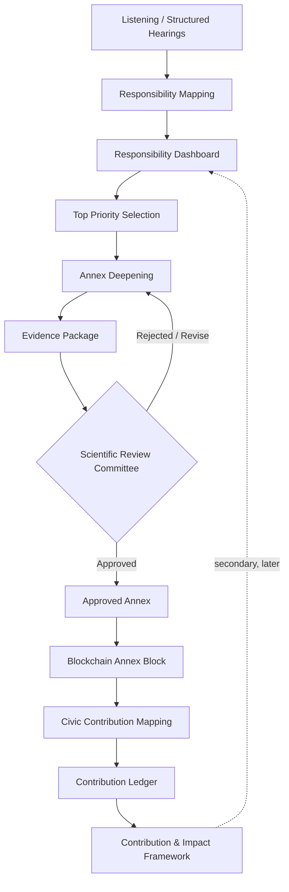
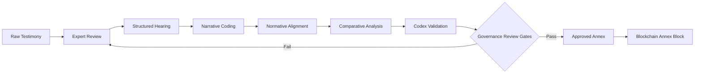
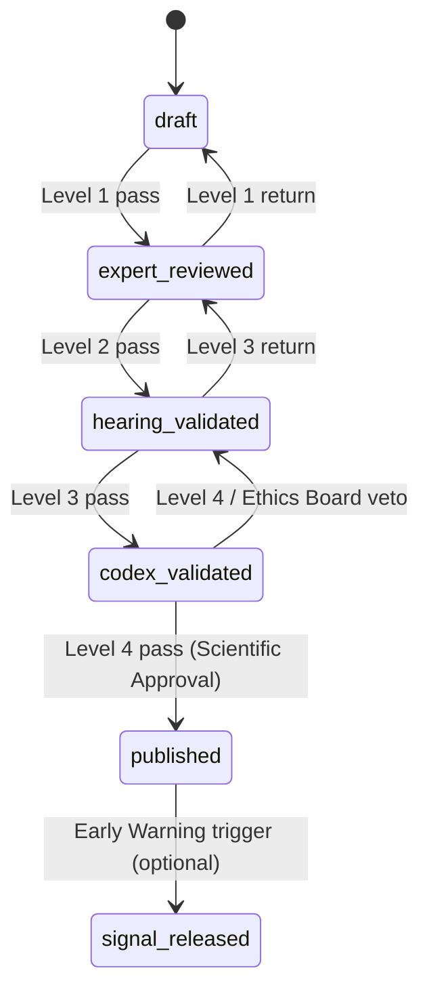
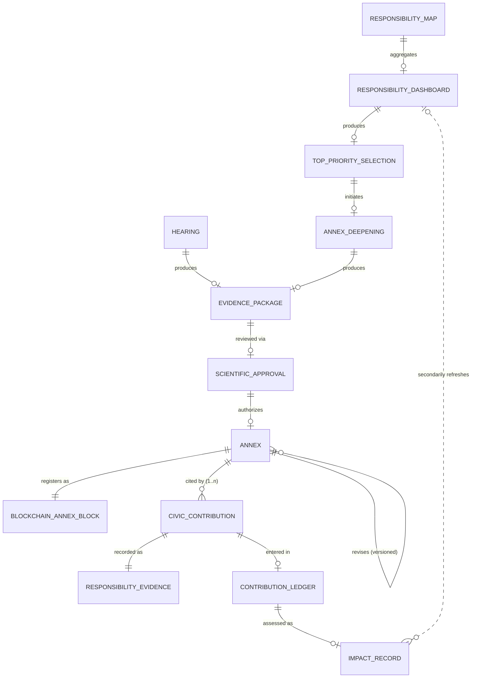

# Annex, Blockchain Verification & Civic Contribution Architecture

**Status:** Foundation Architecture document. Not implementation, not a database schema, not a blockchain platform choice, not smart-contract code. Defines the relationship between existing canonical concepts (Structured Hearings, Responsibility Annexes, the Contribution & Impact Framework) and the new elements introduced by this architecture decision (Scientific Review Committee, Blockchain Annex Block, Civic Contribution, Contribution Ledger).

**Canonical status:** this document is the canonical reference for how a Structured Hearing becomes an approved Annex, how that Annex is integrity-verified, and how it maps to a Civic Contribution. It does not redefine or duplicate `docs/source/methodology/RESPONSIBILITY_ANNEXES.md`, `docs/source/methodology/STRUCTURED_HEARINGS.md`, or `brain/FOUNDATION/02_CONTRIBUTION_IMPACT_FRAMEWORK.md` — those three documents have each been updated with a cross-reference to this one and a small addition reflecting the new lifecycle stage; none of their existing canonical content was rewritten.

---

## 1. Purpose

This document exists to close a gap: prior documents defined Structured Hearings, Responsibility Annexes, and the Contribution & Impact Framework in isolation, but did not specify how an individual hearing's evidence becomes an integrity-verified, tamper-evident record, nor how downstream civic action is required to trace back to that verified record. This architecture makes that chain explicit and closes it against two specific failure modes: (1) a civic contribution being claimed without any verified evidentiary basis, and (2) sensitive testimony being exposed through an integrity mechanism meant only to prove that a record hasn't been altered.

## 2. Full Lifecycle

**Corrected per ADR-016** (superseding this section's original ordering): the Responsibility Dashboard's primary position is upstream, Innovation 3, before Annex generation — it is the prioritization instrument that identifies which patterns should be deepened into Annexes, not primarily a downstream consumer. See §5 for the full reconciliation.



1. **Listening / Structured Hearings** — the facilitated session (`docs/source/methodology/STRUCTURED_HEARINGS.md`), unchanged.
2. **Responsibility Mapping** — accumulates Responsibility Maps (`docs/source/methodology/RESPONSIBILITY_MAPPING.md`), unchanged.
3. **Responsibility Dashboard** — the prioritization instrument (`docs/source/methodology/RESPONSIBILITY_DASHBOARD.md`); aggregates Maps, applies the Observer Panel and HARM Lens, and runs the Responsibility Priority Matrix.
4. **Top Priority Selection** — the Matrix's output: which patterns warrant deeper documentation.
5. **Annex Deepening** — the research and evidence-gathering activity applied to a Top Priority Selection (the same activity as `docs/source/methodology/RESPONSIBILITY_ANNEXES.md`'s existing aggregate-path Workflow steps 1–2), producing an Evidence Package.
6. **Evidence Package** — the documented output of Annex Deepening, assembled for review (§3).
7. **Scientific Review Committee** — reviews the Evidence Package (§3); approves or returns it for revision. No shortcut exists from Evidence Package directly to Annex.
8. **Approved Annex** — the verified evidence unit (§3), only once approved.
9. **Blockchain Annex Block** — an integrity/timestamp/approval record produced only after approval (§3).
10. **Civic Contribution Mapping** — a downstream civic action, responsibility, or intervention is mapped to one or more Approved Annexes (§3).
11. **Contribution Ledger** — the durable record of mapped Civic Contributions (§3) — not a new storage system, an extension of `AuditLog` exactly as Responsibility Evidence already is.
12. **Contribution & Impact Framework** — consumes the Contribution Ledger (§4).
13. **Responsibility Dashboard (secondary, later)** — once Impact Records exist, the Dashboard's Visualizations & Metrics may incorporate them to refresh its aggregate view (§5). This is a secondary role, not the Dashboard's primary process position.

**Note on the direct Hearing path:** a single Structured Hearing may still produce an Evidence Package directly (bypassing Dashboard-driven Top Priority Selection), per `docs/source/methodology/RESPONSIBILITY_ANNEXES.md`'s "direct path." This remains valid as a secondary origination route; the Dashboard-driven route above is now stated as primary, per the user's architecture correction.

## 3. Definitions

- **Hearing** — shorthand used throughout this document for a Structured Hearing (`docs/source/methodology/STRUCTURED_HEARINGS.md`), not a distinct concept. Referenced here as an object in its own right only because it is the lifecycle's starting point.
- **Evidence Package** — the structured, documented output of a Structured Hearing: the account itself, any supporting material gathered during the Hearing, and the Facilitator's notes. It is *not yet* an Annex — it has not been reviewed.
- **Scientific Review Committee** — a named body of Experts and Reviewers (drawing on the existing Expert and Reviewer roles defined in `docs/source/foundation/01_HARM_OPERATING_SYSTEM.md` §Roles) responsible specifically for Annex approval. This is a specific, formal review body, distinct from the general single-Reviewer pattern used elsewhere in the Responsibility Evidence Model — Annex approval requires committee-level review because an Approved Annex triggers an irreversible Blockchain Annex Block.
- **Scientific Approval** — the *record produced by* the Scientific Review Committee's decision (approve or return-for-revision), distinct from the Committee itself (the body) and distinct from the Blockchain Annex Block (the tamper-evidence record produced *from* an approval, not the approval decision itself). A Scientific Approval carries: the reviewing members, the decision, the date, and any conditions attached. It is the direct input to Blockchain Annex Block production.
- **Annex (Approved Annex)** — **the verified evidence unit**, not merely a document or PDF attachment. An Annex is the Evidence Package once the Scientific Review Committee has confirmed its evidentiary basis, quality, and consistency with the organization's trauma-informed and ethical standards. Before approval, it is only an Evidence Package; the term "Annex" (unqualified) always means an *approved* Annex in this architecture.
- **Blockchain Annex Block** — **an integrity, timestamp, and approval record — never the storage of raw sensitive testimony.** It contains: a cryptographic hash of the Approved Annex's content, the Scientific Review Committee's approval signature/attestation, and a timestamp. It proves that a specific, identified Annex was approved at a specific time and has not been altered since. It does not contain the testimony, the participant's identity, or any content capable of re-exposing sensitive material. The underlying Annex content remains governed by the organization's existing Data Policy and Ethics Charter, stored exactly as any other verified evidence record — the blockchain layer adds tamper-evidence, not new storage.
- **Civic Contribution** — a downstream civic action, responsibility, or intervention undertaken in response to one or more Approved Annexes. A Civic Contribution is **not a new concept competing with "Contribution"** as already defined in `brain/FOUNDATION/02_CONTRIBUTION_IMPACT_FRAMEWORK.md` §2/§5 — it is that same concept, specifically in the case where the underlying Responsibility Evidence cites at least one Approved Annex. Every Civic Contribution is a Contribution; not every Contribution is necessarily a Civic Contribution (a Contribution may instead cite a witness account, public record, or other Evidence Source per that framework's §7 Verification methods).
- **Contribution Ledger** — **not a new storage system.** It is the aggregate, append-only view over Responsibility Evidence records that are Annex-mapped Civic Contributions, extending `AuditLog` exactly as the Responsibility Evidence Model already extends it (`brain/GOVERNANCE/RESPONSIBILITY_EVIDENCE_MODEL.md` §7). "Ledger" here names the aggregate view, not a distinct database or blockchain.
- **Impact Record** — not a new concept competing with "Impact" as already defined in `brain/FOUNDATION/02_CONTRIBUTION_IMPACT_FRAMEWORK.md` §9. An Impact Record is the specific, qualitative Impact assessment produced for one Civic Contribution once it is entered in the Contribution Ledger — the discrete instance, in the same relationship as "Civic Contribution" is to "Contribution." It carries the same six qualitative dimensions (Personal, Community, Institutional, Knowledge, Environmental, Policy) defined there; it introduces no new dimension and no numerical score.

## 4. Relationship to the Contribution & Impact Framework

The Contribution & Impact Framework (`brain/FOUNDATION/02_CONTRIBUTION_IMPACT_FRAMEWORK.md`) already defines Contribution, Responsibility Evidence, Verification, Trust, and Impact in general terms. This architecture does not redefine any of them — it specifies one particular, more rigorous path through that framework's existing Contribution Lifecycle (§4 of that document): a Civic Contribution's Responsibility Evidence (§6 of that document) must, in this path, cite at least one Approved Annex as its Evidence Source, and that Annex must itself carry a valid Blockchain Annex Block. The framework's Verification (§7), Trust (§8), and Impact (§9) sections apply unchanged — this architecture only adds a stricter evidentiary requirement for the specific case of Annex-derived contributions.

## 5. Relationship to the Responsibility Dashboard and the HARM Innovation Order

**Corrected by ADR-016.** `docs/source/foundation/01_HARM_OPERATING_SYSTEM.md` sequences the five Innovations as Responsibility Biography Lab → Responsibility Mapping Lab → Responsibility Dashboard → Responsibility Annexes → Civic Intelligence Lab. This was always the correct, primary ordering — the Dashboard's role as prioritization instrument, positioned *before* Annex generation, was never actually in tension with it. An earlier version of this document overstated a conflict by framing the Dashboard primarily as a downstream consumer; that framing is superseded.

**The Dashboard has one primary role and one secondary role, not two parallel equal paths:**
- **Primary (upstream, Innovation 3):** the Dashboard aggregates Responsibility Maps, applies the Observer Panel and HARM Lens, and runs the Responsibility Priority Matrix to produce a Top Priority Selection — this is what feeds Annex Deepening (§2, stages 3–5). This is the ecosystem's default, primary Annex-origination route.
- **Secondary (downstream, later):** once Impact Records exist for prior Civic Contributions, the Dashboard's Visualizations & Metrics may incorporate them to refresh its aggregate view (§2, stage 13). This does not generate new Annexes — it only enriches the Dashboard's own display.

The "direct path" described in `docs/source/methodology/RESPONSIBILITY_ANNEXES.md` (a single Structured Hearing producing an Evidence Package independent of the Dashboard) remains valid as a secondary origination route, not the primary one. See `docs/source/methodology/RESPONSIBILITY_DASHBOARD.md` for the Dashboard's full specification (Observer Panel, HARM Lens, Priority Matrix, Visualizations & Metrics, Zero-Gamification Guardrails).

## 6. Governance Rules

1. **No raw hearing can directly generate a Civic Contribution.** A Structured Hearing's Evidence Package must pass Scientific Review Committee approval before anything derived from it can be mapped as a Civic Contribution.
2. **No Annex becomes authoritative before scientific approval.** An Evidence Package is not an Annex, and carries no evidentiary authority, until the Scientific Review Committee approves it.
3. **No Blockchain Annex Block is produced before approval.** The Block is the *record of* approval, not a step that can precede or substitute for it.
4. **Each Civic Contribution must reference at least one Approved Annex.** No Civic Contribution mapping is valid without at least one specific, identified Annex citation.
5. **Privacy-sensitive testimony must not be stored directly on-chain.** The Blockchain Annex Block contains only a content hash, approval attestation, and timestamp — never the testimony, participant identity, or any re-identifying material. This is a hard constraint, not a configuration choice, and is consistent with the organization's existing Data Policy (`docs/source/governance/DATA_POLICY.md`) and Zero Gamification / no-exploitation principles (`docs/source/governance/ETHICS_CHARTER.md`).
6. **Annexes are immutable after blockchain registration.** Once a Blockchain Annex Block exists for an Annex, that Annex's content is not edited in place. A later correction produces a new, explicitly versioned Annex, fully traceable to the original (citing the prior version and the reason for revision), with its own independent Scientific Approval and its own Blockchain Annex Block. The original Block and Annex version are never deleted or overwritten — this mirrors the Constitution's own "never rewritten in place, only amended and appended" discipline (`brain/00_constitution/00_constitution.md` §17), applied here to Annexes specifically.
7. **Each validated Annex shall be classified under one or more Harm Categories from the National Harm Taxonomy.** Harm Categories classify Annexes; they do not generate them. Annexes originate from validated evidence produced through the Structured Hearing and Scientific Review pipeline (§7, §2). See §12.

These rules operate under, and do not replace, the organization's existing Constitution, Ethics Charter, and Governance Charter — no new governance model is introduced.

## 7. Scientific Review: The Validation Engine

**Definition:** Scientific Review is the validation engine that transforms subjective testimony into governance-grade validated evidence. It validates **mechanisms and evidence quality — never people.** This formalizes and details what §3 and §6 already named as the Scientific Review Committee's function, and resolves the "Validation Engine" item flagged as a Future Proposal requiring a new ADR in `brain/GOVERNANCE/EXECUTION_ALIGNMENT.md` (item 32) — see `architecture/adr/ADR-017-scientific-review-validation-engine.md`. It remains explicitly distinct from the Review & Validation Agent (`ADR-004`), an AI-assisted reviewer *role*, not this validation *process*.

### The complete review pipeline



This pipeline is the detailed internal structure of what §2 calls "Annex Deepening → Evidence Package → Scientific Review Committee → Approved Annex." Raw Testimony, Expert Review, and Structured Hearing correspond to Annex Deepening's evidence-gathering; Narrative Coding through Governance Review Gates correspond to the Scientific Review Committee's review process, now made explicit as four levels rather than one black-box step.

### The four review levels

**Level 1 — Expert Review**
- **Purpose:** initial domain-expert assessment of Raw Testimony's substance and technical claims.
- **Inputs:** Raw Testimony (from Listening/Structured Hearings intake).
- **Outputs:** an Expert Review note, feeding the Structured Hearing.
- **Decision criteria:** does the testimony contain a coherent, checkable claim.
- **Roles:** Expert (existing role, `docs/source/foundation/01_HARM_OPERATING_SYSTEM.md` §Roles).
- **Gate condition:** a testimony with no checkable claim does not proceed; it returns to Listening for further context — it is never discarded or dismissed as invalid experience (Governance Guardrail 5, below).

**Level 2 — Structured Hearing**
- **Purpose:** explore the testimony in depth under safety and quality conditions (existing process, `docs/source/methodology/STRUCTURED_HEARINGS.md`, unchanged).
- **Inputs:** the Expert Review note plus the participant's account.
- **Outputs:** a documented Evidence Package.
- **Decision criteria:** the existing Structured Hearings safety/quality standard.
- **Roles:** Facilitator, Participant, Moderator (existing roles, unchanged).
- **Gate condition:** no Evidence Package is produced without Facilitator sign-off that the session met safety standards.

**Level 3 — Narrative Coding + Normative Alignment**
- **Purpose:** Narrative Coding structures the Evidence Package into analyzable categories against the Harm Codex taxonomy (`docs/source/methodology/HARM_CODEX.md`); Normative Alignment checks the coded narrative against the organization's Core Principles and Ethics Charter; Comparative Analysis checks it against existing Codex entries.
- **Inputs:** the Evidence Package.
- **Outputs:** a coded, normatively-checked, comparatively-analyzed narrative, ready for Codex Validation.
- **Decision criteria:** internal consistency, normative fit, and whether the narrative matches or extends a known Codex mechanism.
- **Roles:** Researcher (coding, comparative analysis), Reviewer (normative alignment check).
- **Gate condition:** a narrative failing normative alignment is returned to Level 1, not silently advanced.

**Level 4 — Governance Review Gates**
- **Purpose:** the Scientific Review Committee's formal, committee-level approval decision — the final gate before Annex status, and the point where the Ethics Board's veto authority applies.
- **Inputs:** the Codex-validated narrative and Comparative Analysis result.
- **Outputs:** a Scientific Approval record (§3) — approve or return for revision.
- **Decision criteria:** the full Review Criteria model, below.
- **Roles:** Scientific Review Committee; Ethics Board (veto only — see Governance Guardrails).
- **Gate condition:** no Approved Annex exists without a Scientific Approval record; an Ethics Board veto overrides a Committee approval and returns the item to Level 3.

### Review Criteria model

Every Level 4 decision is assessed against eight criteria: **Clarity, Structural Accuracy, Analytical Depth, Internal Consistency, Normative Fit, Epistemic Condition, Ethical Compliance, Governance Applicability.** These are qualitative judgment criteria applied by the Scientific Review Committee — never automated into a formula, and never used to produce a numeric score of the testimony's source.

### Governance Guardrails (binding)

1. **AI never validates.** AI may assist with Narrative Coding suggestions or Comparative Analysis candidate matches; it never makes an Expert Review, Hearing, Codex Validation, or Governance Review Gate decision.
2. **Human-in-the-loop is mandatory** at every one of the four levels.
3. **Confidence scores apply only to evidence quality and patterns** (e.g., "this mechanism is well-corroborated") — never to a person's credibility or worth.
4. **Never score people.** Consistent with Zero Gamification (Core Principle 2), applied specifically to Scientific Review.
5. **Reject only the data format — not human experience.** A "return" at Level 1 or Level 3 rejects the testimony's current documentation as insufficiently structured for validation; it never characterizes the underlying human experience as false or unworthy.
6. **Ethics Board has veto authority.** The Ethics Board is a standing body, distinct from the Scientific Review Committee, empowered to veto a Committee approval on ethical grounds at Level 4. It does not originate approvals — only blocks them.
7. **Full audit logging.** Every level transition is logged to `AuditLog`, consistent with the existing Responsibility Evidence Model.
8. **Pseudonymization by default,** consistent with `docs/source/governance/DATA_POLICY.md`'s existing data-minimization standard.

### Lifecycle State Machine



This state machine describes an individual Evidence Package/Annex's own status field as it moves through the four Levels — it is more granular than, and sits alongside (not in place of), the Responsibility Evidence Model's general Created → Evidence Submitted → Human Verification → Accepted/Rejected workflow (`brain/GOVERNANCE/RESPONSIBILITY_EVIDENCE_MODEL.md` §5). `published` corresponds to that model's "Accepted." `signal_released` is an optional terminal state reached only if the validated Annex triggers an Early Warning signal — referenced here by name only (`EARLY_WARNING_PROPOSAL.md`, named in existing project material as "AI Early Warning: Narrative → Signal, Responsibility Briefs"); the full Early Warning specification is not present in this repository, and no additional content about it is invented here.

## 8. AI Integration

AI may assist in assembling an Evidence Package (e.g., organizing a Facilitator's notes) and in surfacing related Annexes for the Scientific Review Committee's reference. AI does not approve an Annex, does not trigger Blockchain Annex Block production, and does not perform Civic Contribution mapping — all three require human action, consistent with `docs/source/foundation/05_AI.md` and `brain/AI/AI_GOVERNANCE_HIERARCHY.md`. See §7 for AI's specifically bounded role within Scientific Review's four levels.

## 9. Entity Relationship Diagram



A Civic Contribution citing zero Annexes cannot exist (Governance Rule 2); a Blockchain Annex Block cannot exist without a prior Scientific Approval (Governance Rules 3–4); an Annex correction always produces a new Annex row, never an update to an existing one (Governance Rule 6). The Dashboard-to-Impact-Record relationship is drawn as optional/secondary (dotted), reflecting its role as a later refresh, not the Dashboard's primary function.

## 10. System Integration (Structured Hearings, HARM Operating System, Contribution & Impact Framework, Responsibility Evidence Model, RPCS, Responsibility Dashboard, AHIP, Codex Research, Early Warning, Validation Engine)

This architecture touches six existing systems. None of them is redefined here — each integration point is stated explicitly to avoid the silent, undocumented coupling this session's consistency discipline is designed to prevent.

- **Structured Hearings** (`docs/source/methodology/STRUCTURED_HEARINGS.md`) — unchanged as a process; gains one additional documented output (Evidence Package) alongside its existing Reflection-bound output. See §2 stage 1.
- **HARM Operating System** (`docs/source/foundation/01_HARM_OPERATING_SYSTEM.md`) — this architecture is a second, parallel Annex-origination path alongside the existing aggregate-pattern path through the Responsibility Dashboard Innovation. See §5 for the full reconciliation; the 12-stage HARM Lifecycle itself is unchanged.
- **Contribution & Impact Framework** (`brain/FOUNDATION/02_CONTRIBUTION_IMPACT_FRAMEWORK.md`) — Civic Contribution and Impact Record are, respectively, the Annex-sourced instance of that framework's Contribution and Impact concepts (§4 above, and §3's Impact Record definition). Trust (§8 of that framework) is unaffected — Annex-sourced Contributions accrue Trust through the same mechanism as any other verified Contribution, no differently weighted.
- **Responsibility Evidence Model** (`brain/GOVERNANCE/RESPONSIBILITY_EVIDENCE_MODEL.md`) — a Civic Contribution's Responsibility Evidence record uses this model's existing verification workflow unchanged (Created → Evidence Submitted → Human Verification → Accepted/Rejected → `AuditLog`); this architecture adds only a constraint on that record's Evidence Source field (must cite ≥1 Approved Annex), not a new workflow.
- **RPCS** (`docs/source/academy/RPCS_PROGRAM.md`) — RPCS tracks supply the trained people who staff this lifecycle: the **Trauma-Informed Facilitation** track trains the Facilitators who run Structured Hearings (stage 1); the **Codex Research** track trains researchers whose expertise supports Scientific Review Committee membership (stage 3); the **AHIP Specialist** track trains the intake moderators upstream of the Hearing itself. RPCS certification does not itself grant Scientific Review Committee membership — that remains a separate, explicit appointment, consistent with RPCS's existing "no abstract credentials" principle (`RPCS_PROGRAM.md` §Core Principles).
- **Responsibility Dashboard** (`docs/source/methodology/RESPONSIBILITY_DASHBOARD.md`) — **primary role:** the prioritization instrument that produces the Top Priority Selection feeding Annex Deepening (§2, stages 3–5). **Secondary role:** later refresh of its aggregate view using validated Impact Records (§2, stage 13). See §5 for the full correction record and `RESPONSIBILITY_DASHBOARD.md` for the complete specification (Observer Panel, HARM Lens, Priority Matrix, Zero-Gamification Guardrails).
- **AHIP** (`docs/source/methodology/AHIP.md`) — supplies the intake that produces Raw Testimony ahead of Scientific Review Level 1 (§7).
- **Codex Research** (RPCS track, `docs/source/academy/RPCS_PROGRAM.md`) — trains the researchers who perform Narrative Coding and Comparative Analysis at Scientific Review Level 3 (§7). RPCS certification does not itself grant Scientific Review Committee or Ethics Board membership, consistent with §9's earlier RPCS note.
- **Early Warning** — the optional downstream consumer of a `published` Annex (§7's state machine), producing a `signal_released` state. Referenced by name only (`EARLY_WARNING_PROPOSAL.md`); its full specification is not present in this repository and no additional content about it is invented here.
- **Validation Engine** — Scientific Review (§7) *is* this ecosystem's Validation Engine, resolving the Future Proposal flagged in `brain/GOVERNANCE/EXECUTION_ALIGNMENT.md` (item 32). See `architecture/adr/ADR-017-scientific-review-validation-engine.md`.

## 11. Validation

- **Compatible with Core Domain Model (LOCKED)** — no new entity is added to that locked document; `AuditLog` is reused, not redefined. The Contribution Ledger and Blockchain Annex Block are described here as architecture concepts; any future domain-entity representation of them requires its own ADR against the locked model, not performed here.
- **Compatible with Application Architecture (LOCKED)** — no service ownership is asserted or altered.
- **Compatible with Responsibility Evidence Model** — Civic Contribution's Responsibility Evidence requirement is an additional constraint on Evidence Source (§4 of that model), not a redefinition of it.
- **Compatible with Contribution & Impact Framework** — see §4 above; no redefinition.
- **Compatible with Structured Hearings and Responsibility Annexes methodology documents** — both updated with a cross-reference and one small addition each (Evidence Package as an output; Scientific Review Committee and Blockchain Annex Block as an additional approval/output step), not rewritten.
- **Compatible with `brain/GOVERNANCE/EXECUTION_ALIGNMENT.md`** — §7's Validation Engine formalization directly resolves that document's item 32 (Future Proposal, new ADR required), without redefining the distinct Review & Validation Agent role (`ADR-004`).
- **Compatible with AHIP, RPCS, and Harm Codex** — Scientific Review's four levels (§7) reuse these documents' existing roles and taxonomy; no new role or taxonomy category is introduced without cross-reference.
- **No architectural drift introduced.** This document specifies architecture only — no blockchain platform, consensus mechanism, smart contract, or storage schema is chosen or specified here. The Ethics Board is introduced as a governance role with veto authority, not as a new domain entity in the LOCKED Core Domain Model.

## 12. National Harm Taxonomy — Classification Layer

**Not a new framework.** The National Harm Taxonomy is the formal name for the taxonomy already proposed in `docs/source/methodology/HARM_CODEX.md` §Workflow: **institutional mechanisms, systemic patterns, procedural failures** (Version 1.0 proposal, pending approval — unchanged, not redefined here). This section formalizes that taxonomy's role as the classification layer for the Annex lifecycle and names its integration points; it does not introduce a parallel lifecycle, a new category list, or a new governance module.

**Governance Rule 7** (§6) requires every *validated* Annex to be classified under at least one Harm Category, applied **after** Scientific Review approval (§7) — classification is not a precondition for, and does not generate, an Annex. This reuses the existing `categorized_as` edge already defined for `CodexEntry → HarmCategory` in `brain/ARCHITECTURE/CIVIC_INTELLIGENCE_KNOWLEDGE_GRAPH_RELATIONSHIP.md` §4 — extended here to `Annex → HarmCategory` as the same edge type, not a new one. The edge's direction (Annex points to its category, never the reverse) is itself evidence that classification follows the Annex's existence, not the other way around.

**Classification layer across the ecosystem** (each touchpoint below already exists in its own canonical document; this table only names the National Harm Taxonomy as the shared classification each one uses — none is redefined):

| System | How it consumes the National Harm Taxonomy | Already established in |
|---|---|---|
| Responsibility Dashboard | Aggregate Visualizations & Metrics may be filtered/grouped by Harm Category | `docs/source/methodology/RESPONSIBILITY_DASHBOARD.md` §Framework (unchanged) |
| Priority Selection | The Responsibility Priority Matrix's Top Priority Selection considers Harm Category distribution among candidate patterns | `RESPONSIBILITY_DASHBOARD.md` §Framework (unchanged) |
| Scientific Review | Level 3 (Narrative Coding) already "structures the Evidence Package into analyzable categories against the Harm Codex taxonomy" | §7, above (unchanged) |
| Annex | Classified under ≥1 Harm Category **after** validation (new — Governance Rule 7); classification never generates or gates the Annex itself | This document, §6 |
| Blockchain Record | The Blockchain Annex Block's content hash covers the Annex including its Harm Category citation; no structural change to the Block itself | §3 Definitions (unchanged) |
| Civic Contribution | Inherits Harm Category classification via its cited Approved Annex(es) — no separate classification of its own | §4 (unchanged) |
| Knowledge Graph | `HarmCategory` node type + `categorized_as` edge already model this exactly | `brain/ARCHITECTURE/CIVIC_INTELLIGENCE_KNOWLEDGE_GRAPH_RELATIONSHIP.md` §3–4 (unchanged) |
| Civic Intelligence | Pattern Recognition already groups by "same HarmCategory + same ActorCategory + similar Pathways" | `brain/ARCHITECTURE/CIVIC_INTELLIGENCE_KNOWLEDGE_GRAPH_RELATIONSHIP.md` §6 (unchanged) |
| Early Warning | Harm Pathways (`compounds_into`) are inherently Harm-Category-scoped; referenced by name only — no full Early Warning specification exists in this repository | §7, above; `CIVIC_INTELLIGENCE_KNOWLEDGE_GRAPH_RELATIONSHIP.md` §4 (unchanged) |

No entity is added to `brain/DOMAIN/CORE_DOMAIN_MODEL.md` (LOCKED) by this section — `HarmCategory` remains the conceptual Knowledge Graph node type it already was.

## 13. Philosophical Basis of Annex Generation and Transferable Civic Value

**Canonical principle:** every person may carry testimony, lived experience, knowledge, observation, documents, or other forms of evidence that may become an Annex if it successfully passes the approved review pathway (§7, §2). **An Annex is the canonical representation of validated civic knowledge** — this is a framing of the existing Annex definition (§3), not a redefinition of it.

**Annexes originate from:** reported harms, testimonies, lived experiences, documentary evidence, community knowledge, structured observations, and other evidence accepted through the approved review process — i.e., Raw Testimony (§7 Level 1) and External Evidence/Direct Submission (`ADR-020`'s Direct Annex Path), enumerated here at the level of concrete source types rather than process-stage names. **Scientific Review determines whether submitted material is sufficiently validated to become an Annex** (§7, unchanged) — no new decision authority is introduced.

**Harm Categories are not generative.** Restated once more, consistent with §6 Rule 7 and §12: they are a post-validation classification layer applied only after an Annex has been approved, existing to organize validated Annexes so they can be connected across the ecosystem — not to produce, gate, or precede them.

### Transferable Civic Value

The value of an Annex is not the document itself, but its ability to transform reported harm into transferable civic value:

- **Evidence value** — a checkable, citable record.
- **Governance value** — a basis for institutional accountability.
- **Learning value** — durable institutional and community memory.
- **Policy value** — informs future policy consideration.
- **Repair value** — supports remedy where harm is acknowledged.
- **Contribution value** — the basis a Civic Contribution cites (§3, §4).

This transferable civic value is what enables future civic action, institutional learning, democratic accountability, and social repair. It is produced once, at Annex approval, and is what Harm Category classification organizes for downstream use — the classification itself creates no new value; it makes already-created value findable and connectable.

**Future-facing clarification, not a commitment:** Transferable Civic Value may later become the conceptual basis for value accounting, contribution recognition, or tokenized civic value mechanisms. **No token, coin, financial instrument, exchange mechanism, or tokenomics model is introduced at this stage.** Any future tokenization requires its own feasibility study, legal review, ethics review, platform architecture decision, and dedicated ADR — none of which is performed or implied here. This clarification does not modify the Blockchain Annex Block's existing integrity/timestamp/approval role (§3, §6 Rule 5) in any way.

### Reconciling the Value Lifecycle with the Existing Process Lifecycle

The following is a **value-narrative view** of the same underlying process already described in §2 — it does not introduce a parallel or competing technical lifecycle, and does not alter §2's diagram or stage ordering:

```
Reported Harm / Testimony / Lived Experience / Documentary Evidence
  ↓
Structured Hearing / Approved Review Path        (§2 stages 1, 5-6; ADR-020's two paths)
  ↓
Scientific Review                                 (§7)
  ↓
Validated Evidence
  ↓
Approved Annex                                     (§2 stage 8)
  ↓
Harm Category Classification                       (§6 Rule 7, §12 — post-validation only)
  ↓
Transferable Civic Value                           (this section)
  ↓
Civic Contribution                                  (§2 stages 10-12)
  ↓
Knowledge Graph                                     (ADR-007, CIVIC_INTELLIGENCE_KNOWLEDGE_GRAPH_RELATIONSHIP.md)
  ↓
Civic Intelligence                                  (CIVIC_INTELLIGENCE_LAYER.md)
  ↓
Early Warning                                       (referenced by name only, §7, §10)
  ↓
Future Democratic Learning & Institutional Repair   (= Institutional Learning / Governance Improvement,
                                                       01_HARM_OPERATING_SYSTEM.md §Framework, unchanged)
```

**Blockchain Annex Block is not omitted from the architecture** — it is implicit within "Approved Annex" at this level of abstraction (it is the integrity record *of* the Approved Annex, per §3), simply not named at the value-narrative level shown here. §2 remains the authoritative process-stage diagram; this section is its value-meaning counterpart, not a substitute.

---

*Self-review complete. Reconciled with, not duplicating: `docs/source/methodology/RESPONSIBILITY_ANNEXES.md`, `docs/source/methodology/STRUCTURED_HEARINGS.md`, `docs/source/methodology/AHIP.md`, `docs/source/methodology/HARM_CODEX.md`, `brain/FOUNDATION/02_CONTRIBUTION_IMPACT_FRAMEWORK.md`, `brain/GOVERNANCE/RESPONSIBILITY_EVIDENCE_MODEL.md`, `docs/source/academy/RPCS_PROGRAM.md`, `docs/source/methodology/RESPONSIBILITY_DASHBOARD.md`, `brain/GOVERNANCE/EXECUTION_ALIGNMENT.md`. See `architecture/adr/ADR-014-annex-blockchain-civic-contribution-architecture.md` for the original decision record, `architecture/adr/ADR-015-annex-architecture-extension.md` for the ERD/per-object/immutability extension, `architecture/adr/ADR-016-responsibility-dashboard-specification.md` for the Dashboard-primacy correction, `architecture/adr/ADR-017-scientific-review-validation-engine.md` for the Scientific Review validation-engine formalization, `architecture/adr/ADR-021-national-harm-taxonomy-classification-layer.md` for the National Harm Taxonomy classification-layer integration (§12), and `architecture/adr/ADR-022-transferable-civic-value.md` for the Transferable Civic Value concept and value-lifecycle reconciliation (§13).*
