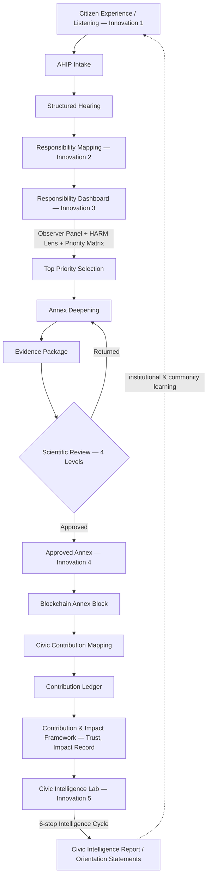

# Innovation Structure — Canonical Architecture Overview

```
Type: Project (Canonical Overview / Root Document)
Status: Canonical
Version: 1.0.0
Authorized by: N/A — pure synthesis of already-canonical content, no new decision introduced
Extends/Reconciles with: docs/source/foundation/01_HARM_OPERATING_SYSTEM.md,
  docs/source/methodology/RESPONSIBILITY_MAPPING.md,
  docs/source/methodology/RESPONSIBILITY_DASHBOARD.md,
  docs/source/methodology/RESPONSIBILITY_ANNEXES.md,
  docs/source/methodology/CIVIC_INTELLIGENCE.md,
  brain/FOUNDATION/02_CONTRIBUTION_IMPACT_FRAMEWORK.md,
  brain/FOUNDATION/03_ANNEX_BLOCKCHAIN_CIVIC_CONTRIBUTION_ARCHITECTURE.md,
  brain/ARCHITECTURE/CIVIC_INTELLIGENCE_LAYER.md,
  brain/ARCHITECTURE/CIVIC_INTELLIGENCE_KNOWLEDGE_GRAPH_RELATIONSHIP.md,
  architecture/adr/ADR-007-knowledge-graph.md
```

**This is the canonical architecture overview of the entire Res Publica Responsibility Lab ecosystem — the root document for all Responsibility Lab Innovations.** It is not another specification. It defines nothing new: every concept named here is owned canonically by another document, cited and linked, never redefined. Its sole purpose is to show, in one place, how the pieces that were built separately (across roughly a dozen documents and ADR-007, ADR-013 through ADR-019) actually fit together as a single ecosystem.

---

## 1. Purpose

Each Responsibility Lab Innovation, and each supporting system around it, has been specified in its own canonical document. No single document, before this one, showed the complete, end-to-end picture — from a citizen's first account to institutional learning — in one continuous view. This document is that missing overview, synthesized strictly from what is already canonical. It introduces no new architecture decision, which is why no ADR authorizes it (per `standards/RP_STANDARD_001_DOCUMENTATION_ARCHITECTURE.md` §9, traceability applies to documents that introduce a decision; this one summarizes decisions already made elsewhere).

## 2. The Five Canonical Innovations

| # | Canonical Name | UI Label | Canonical Document | Purpose |
|---|---|---|---|---|
| 1 | Responsibility Biography Lab | Biography Lab | `docs/source/methodology/HARM_LIFECYCLE.md` / `docs/source/foundation/01_HARM_OPERATING_SYSTEM.md` (no dedicated methodology file — see §5, Gap 1) | Listening: captures Citizen Experience |
| 2 | Responsibility Mapping Lab | Mapping Lab | `docs/source/methodology/RESPONSIBILITY_MAPPING.md` | Identifies who/what holds responsibility |
| 3 | Responsibility Dashboard | Dashboard | `docs/source/methodology/RESPONSIBILITY_DASHBOARD.md` | Prioritization instrument (Observer Panel, HARM Lens, Priority Matrix) |
| 4 | Responsibility Annexes | Annexes | `docs/source/methodology/RESPONSIBILITY_ANNEXES.md` | Produces the verified evidence unit (the Annex) |
| 5 | Civic Intelligence Lab | Civic Intelligence Lab | `docs/source/methodology/CIVIC_INTELLIGENCE.md`, deepened by `brain/ARCHITECTURE/CIVIC_INTELLIGENCE_LAYER.md` | Synthesizes validated evidence into collective understanding |

**Not yet canonical, flagged, not adopted here:** `brain/ARCHITECTURE/CIVIC_INTELLIGENCE_LAYER.md` names two further Innovations — 6 (Policy & Action Lab) and 7 (Responsibility Observatory) — explicitly as proposed extensions pending their own future decision against `01_HARM_OPERATING_SYSTEM.md`. This document does not treat them as canonical, consistent with that document's own flag and `ADR-019`'s (draft) Open Question 1.

## 3. The Unified Lifecycle

This is the first document to show the complete path in one continuous diagram — every stage name below is taken directly from an existing canonical document; none is invented here.



Every node above is owned by exactly one existing canonical document (§7, References). The **Knowledge Graph** (`ADR-007`, specialized by `brain/ARCHITECTURE/CIVIC_INTELLIGENCE_KNOWLEDGE_GRAPH_RELATIONSHIP.md`) is not a stage in this flow — it is the persistent memory layer underlying every stage, per its own core sentence: *"The Knowledge Graph is the memory; the Civic Intelligence Layer is the thinking about it."*

## 4. Supporting Systems (each canonically owned elsewhere)

- **Scientific Review** — the four-level validation engine (`brain/FOUNDATION/03_ANNEX_BLOCKCHAIN_CIVIC_CONTRIBUTION_ARCHITECTURE.md` §7). Not redefined here.
- **Blockchain Annex Architecture** — the integrity/immutability layer for Approved Annexes (same document, §2–§6).
- **Contribution & Impact Framework** — Trust and Impact Record semantics (`brain/FOUNDATION/02_CONTRIBUTION_IMPACT_FRAMEWORK.md`). Not redefined here.
- **Knowledge Graph** — the persistent memory substrate (`ADR-007`, `brain/ARCHITECTURE/CIVIC_INTELLIGENCE_KNOWLEDGE_GRAPH_RELATIONSHIP.md`). Not redefined here.

## 5. Genuine Gaps Identified (explicit, not smoothed over)

1. **Innovation 1 has no dedicated methodology document.** Innovations 2–5 each have their own `docs/source/methodology/*.md` file; Innovation 1 (Responsibility Biography Lab) is described only within `HARM_LIFECYCLE.md` and `01_HARM_OPERATING_SYSTEM.md`. This asymmetry was noted once before, during this session's original build, and was never resolved.
2. **Innovations 6 and 7 remain unresolved.** Named in `CIVIC_INTELLIGENCE_LAYER.md`, not yet adopted into the canonical 5-Innovation list, per `ADR-019`'s (draft) open questions.
3. **No prior document showed the full end-to-end lifecycle in one place.** Each piece (HARM Lifecycle, Annex/Blockchain lifecycle, Scientific Review pipeline, Civic Intelligence Cycle) existed only in its own document. This document's §3 is the first synthesis — worth stating plainly as the actual gap this document exists to close.
4. **The Knowledge Graph specialization is still Draft.** `brain/ARCHITECTURE/CIVIC_INTELLIGENCE_KNOWLEDGE_GRAPH_RELATIONSHIP.md` and its authorizing `ADR-019` are not yet approved. This overview cites Draft-status material for the Knowledge Graph section specifically — flagged so that status isn't silently implied to be Canonical.
5. **Ethics Board's interaction with the Knowledge Graph schema is unstated.** The graph's `Review` node and `validated_by` edge do not explicitly represent an Ethics Board veto outcome as distinct from ordinary Scientific Review Committee approval — a real, small modeling gap, not resolved here.
6. **RPCS-track-to-Innovation-role mapping is only partial.** `brain/FOUNDATION/03_ANNEX_BLOCKCHAIN_CIVIC_CONTRIBUTION_ARCHITECTURE.md` §10 maps some RPCS tracks (Trauma-Informed Facilitation, Codex Research, AHIP Specialist) to specific lifecycle roles, but no document maps all RPCS tracks against all five Innovations comprehensively.

No other inconsistency was found — the nine source documents were checked against each other's stated terminology, lifecycle ordering, and role names, and no contradiction (as opposed to the six genuine gaps above) was identified.

## 6. Governance

This document does not alter the governance of any Innovation or supporting system it references. Amending any cited document's content requires following that document's own governance rules; amending this overview to reflect such a change is a Version bump here (per `standards/RP_STANDARD_001_DOCUMENTATION_ARCHITECTURE.md` §6), not a new decision.

## 7. References

`docs/source/foundation/01_HARM_OPERATING_SYSTEM.md` · `docs/source/methodology/RESPONSIBILITY_MAPPING.md` · `docs/source/methodology/RESPONSIBILITY_DASHBOARD.md` · `docs/source/methodology/RESPONSIBILITY_ANNEXES.md` · `docs/source/methodology/CIVIC_INTELLIGENCE.md` · `brain/FOUNDATION/02_CONTRIBUTION_IMPACT_FRAMEWORK.md` · `brain/FOUNDATION/03_ANNEX_BLOCKCHAIN_CIVIC_CONTRIBUTION_ARCHITECTURE.md` · `brain/ARCHITECTURE/CIVIC_INTELLIGENCE_LAYER.md` · `brain/ARCHITECTURE/CIVIC_INTELLIGENCE_KNOWLEDGE_GRAPH_RELATIONSHIP.md` · `architecture/adr/ADR-007-knowledge-graph.md`

## Related Documents

All nine documents listed in §7, plus `standards/RP_STANDARD_001_DOCUMENTATION_ARCHITECTURE.md` (the governance standard this document itself conforms to).
